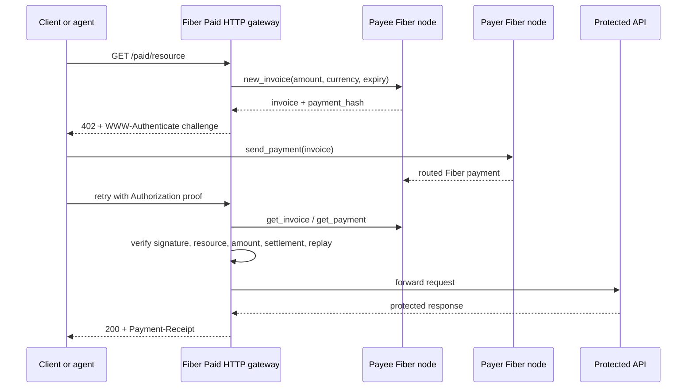
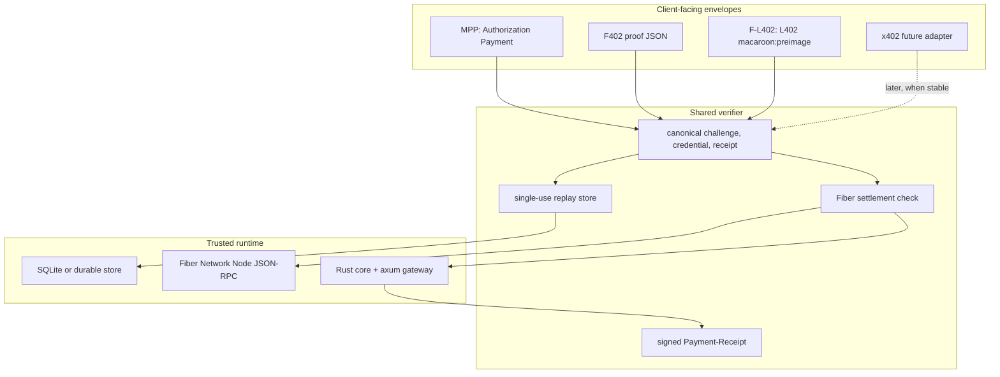
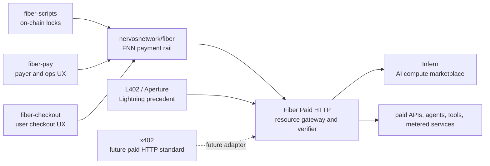
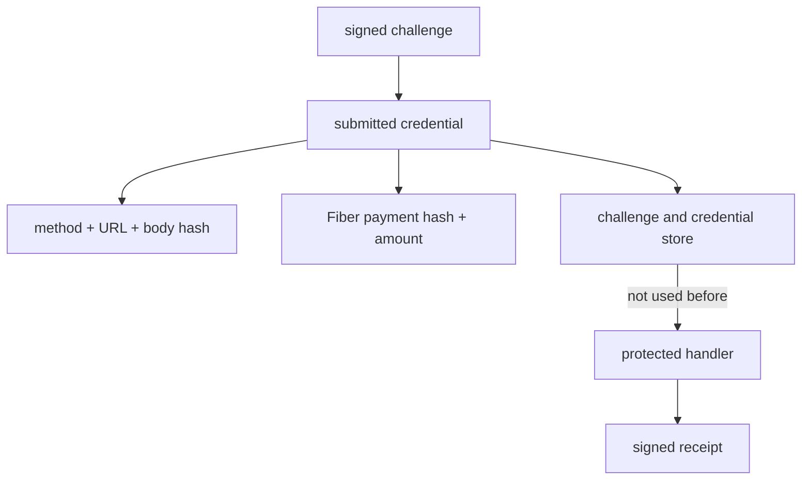
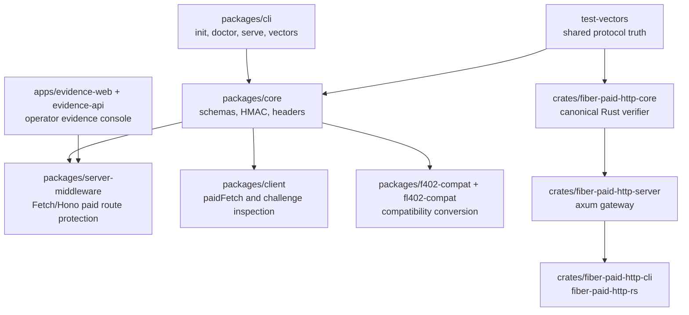

# Fiber Paid HTTP

Fiber Paid HTTP is a Rust-first gateway and TypeScript SDK/tooling stack for paid HTTP APIs on [Fiber](https://github.com/nervosnetwork/fiber).

The simple story is this: HTTP has a dormant `402 Payment Required` status, and Fiber gives CKB applications a fast payment-channel network. This project joins the two without turning itself into a wallet, marketplace, checkout product, or Fiber node dashboard. It gives an API a way to say "pay this exact invoice for this exact resource", verify settlement through Fiber, block replay, serve the resource, and return a signed receipt.

MPP, F402, and F-L402 are compatibility envelopes around the same core verifier:

- **MPP + Fiber** is the primary `WWW-Authenticate: Payment` / `Authorization: Payment` flow.
- **F402** bridges Fiber invoice/payment-hash 402 applications such as [Infern](https://github.com/truthixify/infern).
- **F-L402** brings L402-style `macaroon:preimage` semantics to Fiber invoices without claiming Lightning Labs macaroon byte compatibility.
- **x402** is treated as a future adapter boundary until Fiber verify/settle APIs are stable enough to make it a real trusted path.

## Why this exists

Small paid APIs need a boring, explicit contract:

1. The server states the price and resource binding.
2. The payer settles a real Fiber invoice.
3. The gateway verifies payment against the same invoice, amount, method, and URL.
4. The protected handler runs once.
5. The client gets a signed receipt.

The hard part is not issuing a `402`; the hard part is avoiding vague proof, stale invoices, replayable credentials, unpaid service, or paid-but-denied outcomes. Fiber Paid HTTP keeps those checks in one place and makes every compatibility surface feed the same verifier.



## Design principles

- **Real settlement only**: no offline payment execution mode. `FIBER_MODE=local` or `testnet` must point at real payer/payee Fiber RPC endpoints.
- **One invoice, one resource**: credentials bind to method, URL, body hash when needed, amount, currency, payment hash, and challenge id.
- **Receipts are first-class**: a successful request returns `Payment-Receipt`, signed separately from the challenge.
- **Rust is the trusted boundary**: Rust owns canonical verification and the production gateway path. TypeScript owns SDKs, middleware, evidence UI, adapters, and vector tooling.
- **Adapters are adapters**: MPP, F402, F-L402, and future x402 entrypoints converge into the same replay, settlement, and receipt checks.
- **Operational honesty beats demo magic**: the gate reports skipped, local, and testnet evidence explicitly instead of pretending live Fiber is configured when it is not.



## Ecosystem awareness

Fiber Paid HTTP is deliberately a middle layer. It should make other Fiber paid-resource projects easier to build, not absorb their product surface.

| Project or protocol | What it does | Relationship to Fiber Paid HTTP |
| --- | --- | --- |
| [nervosnetwork/fiber](https://github.com/nervosnetwork/fiber) | Reference Fiber Network Node and protocol implementation. | Upstream payment rail. Fiber Paid HTTP verifies through FNN JSON-RPC; it does not fork or replace the node. |
| [@nervosnetwork/fiber-js](https://www.npmjs.com/package/%40nervosnetwork/fiber-js) | JavaScript wrapper around Fiber WASM. | Future browser or Node payer runtime. Useful for clients, not the server verifier boundary. |
| [nervosnetwork/fiber-scripts](https://github.com/nervosnetwork/fiber-scripts) | Fiber on-chain scripts such as funding and commitment locks. | Lower-level chain infrastructure. Fiber Paid HTTP stays above it and talks to FNN. |
| [Infern](https://github.com/truthixify/infern) | AI compute marketplace paid per request over Fiber/F402. | Vertical marketplace. Fiber Paid HTTP is horizontal gateway infrastructure that Infern-like services can use or interoperate with. |
| [fiber-pay](https://talk.nervos.org/t/fiber-pay-an-ai-friendly-cli-for-fiber-network/9974) | AI-friendly CLI/runtime for opening channels and making Fiber payments. | Payer/operator companion. Good for setup and client-side payment UX; not imported into the trusted verifier path. |
| [fiber-checkout](https://talk.nervos.org/t/spark-program-fiber-checkout-a-stripe-style-react-payment-library-for-fiber-network/10045) | React checkout/payment component idea for Fiber. | User-facing checkout layer. It can sit in front of Fiber Paid HTTP, while this repo stays focused on API challenge and verification. |
| [Lightning L402](https://github.com/lightninglabs/L402) and [Aperture](https://github.com/lightninglabs/aperture) | Lightning HTTP 402, macaroons, and reverse proxy precedent. | Design inspiration. F-L402 copies the split between payment request, bearer credential, and authenticated retry, but uses Fiber invoices and local HMAC caveats. |
| [x402](https://github.com/x402-foundation/x402) | Open paid HTTP standard for internet-native payments across networks and forms of value. | Strategic future adapter. Fiber Paid HTTP should plug in when Fiber-native verify/settle support is stable enough to keep the verifier honest. |



## Adapter surface

| Surface | Status | HTTP/auth shape | Role |
| --- | --- | --- | --- |
| MPP + Fiber | Primary | `WWW-Authenticate: Payment`, `Authorization: Payment`, `Payment-Receipt` | Stable gateway envelope and receipt model. |
| F402 | Compatible | Fiber invoice/payment-hash JSON challenge and proof conversion | Bridge for Infern-style Fiber 402 applications. |
| F-L402 | First-class adapter | `WWW-Authenticate: L402`, `Authorization: L402 macaroon:preimage` | Application-level macaroon/preimage compatibility backed by the same Fiber invoice and receipt verifier. |
| x402 | Future boundary | Native x402 headers / verify / settle | Not implemented until Fiber node x402 support is available as a stable integration target. |

## What it is not

- Not an AI inference marketplace.
- Not a full checkout product.
- Not a wallet.
- Not a multi-rail stablecoin bridge into Fiber.
- Not a replacement for Infern, fiber-pay, fiber-checkout, or FNN.

## Quick start

```bash
pnpm install --frozen-lockfile
pnpm build
pnpm exec fiber-paid-http init --role gateway --out fiber-paid-http.gateway.json
export FIBER_PAID_HTTP_SECRET="$(openssl rand -hex 32)"
pnpm exec fiber-paid-http doctor --role gateway --config fiber-paid-http.gateway.json
pnpm exec fiber-paid-http serve --config fiber-paid-http.gateway.json
```

Use Node 24 and pnpm 10.12.1 or newer. `.node-version` and `.nvmrc` are provided for local version managers.

The doctor command prints exact blockers until `FIBER_MODE`, payee Fiber RPC, storage, upstream, signing secret, Fiber peers, and `ChannelReady` channels are configured.

The configured gateway exposes `GET /healthz`, `GET /readyz`, and `GET /metrics`, rejects disallowed browser origins before challenge issuance, enforces protected-route rate limits and a request body limit, writes structured JSON request logs, and shuts down gracefully on `SIGINT`/`SIGTERM`.

## Judge demo path

For hackathon review, use [docs/hackathon-submission.md](docs/hackathon-submission.md) as the submission packet and [docs/README.md](docs/README.md) as the full documentation map.

Local Evidence Console demo:

```bash
pnpm install --frozen-lockfile
pnpm build
pnpm evidence:api
```

In another shell:

```bash
pnpm evidence:web
```

The Flow workspace demonstrates `402 -> Fiber payment/proof -> Authorization retry -> Payment-Receipt -> replay rejection`. The Evidence workspace links the committed reports for Rust/TypeScript parity, security coverage, testnet evidence, and production bootstrap evidence.

## Evidence paths

For the reproducible local Fiber network used by the evidence suite:

```bash
scripts/fiber_local_network.sh up
```

After the local network is running, set the local env and run the live Fiber lane:

```bash
export RUN_FIBER_E2E=1
export FIBER_MODE=local
export FIBER_PAYEE_RPC_URL=http://127.0.0.1:21716
export FIBER_PAYER_RPC_URL=http://127.0.0.1:21714
export FIBER_CURRENCY=Fibd
export FIBER_PAID_HTTP_SECRET="$(openssl rand -hex 32)"
pnpm test:fiber
```

For testnet evidence, start or point at two funded Fiber testnet nodes, connect peers, wait for `ChannelReady` channels, and then run the same live Fiber lane with:

```bash
export RUN_FIBER_E2E=1
export FIBER_MODE=testnet
export FIBER_CURRENCY=Fibt
export FIBER_PAYEE_RPC_URL=<payee rpc url>
export FIBER_PAYER_RPC_URL=<payer rpc url>
export FIBER_PAID_HTTP_SECRET="$(openssl rand -hex 32)"
pnpm exec fiber-paid-http doctor --role payer
pnpm exec fiber-paid-http doctor --role payee
pnpm test:fiber
```

Once the payer/payee testnet nodes are funded, connected, and `ChannelReady`, the same evidence path can be run through:

```bash
scripts/fiber_testnet_e2e.sh
```

See [docs/bootstrap.md](docs/bootstrap.md), [docs/production-operations.md](docs/production-operations.md), [docs/fiber-client-wallet-integration-plan.md](docs/fiber-client-wallet-integration-plan.md), [docs/fiber-local-e2e.md](docs/fiber-local-e2e.md), and [docs/fiber-testnet-e2e.md](docs/fiber-testnet-e2e.md) for gateway, payer, payee, operations, wallet/client boundaries, local evidence, and testnet evidence steps.

## Security model

Challenges and receipts are HMAC-signed canonical JSON. Credentials bind to a resource hash and are single-use. The middleware verifies challenge signature, expiry, method, resource, Fiber payment hash, Fiber amount, and replay state before serving protected resources.



## Fiber RPC configuration

Fiber Paid HTTP requires real local or testnet Fiber RPC endpoints. Local/testnet attempts require separate payer and payee nodes:

```bash
FIBER_MODE=local
FIBER_PAYEE_RPC_URL=http://127.0.0.1:21716
FIBER_PAYER_RPC_URL=http://127.0.0.1:21714
FIBER_PAID_HTTP_SECRET=<32+ character random signing secret>
FIBER_RPC_AUTH=<optional shared Authorization header value>
FIBER_PAYEE_NODE_ID=<optional payee node id/pubkey>
FIBER_PAYER_NODE_ID=<optional payer node id/pubkey>
FIBER_PAID_HTTP_FL402_ROOT_KEY=<optional F-L402 root key, 16+ characters>
```

Use `FIBER_MODE=testnet` for testnet. Receipts are marked `settled` only after Fiber RPC reports a settled invoice/payment status.

## How the adapters differ

### MPP

Fiber Paid HTTP follows the MPP HTTP flow:

```text
unpaid request -> 402 + WWW-Authenticate: Payment
payment -> Authorization: Payment retry
verified resource -> Payment-Receipt
```

### F402

Infern popularised the Fiber-specific idea of returning a Fiber invoice from HTTP 402 and retrying with payment proof. Fiber Paid HTTP keeps that shape as a converter into its internal challenge and credential model. It intentionally avoids marketplace fields such as model routing, reputation, staking, or provider discovery.

### F-L402

Lightning L402 combines HTTP 402, Lightning invoices, macaroons, and an authenticated retry. Fiber Paid HTTP implements an application-level Fiber version: it issues `fl402-macaroon-v1` HMAC caveat tokens, verifies `macaroon:preimage` proofs, and converts the proof into the same internal Fiber credential path used by MPP. It does not claim byte-level compatibility with Lightning Labs macaroons.

### x402

x402 is a likely long-term paid HTTP shape for many ecosystems. Fiber Paid HTTP keeps x402 as a future adapter boundary rather than making x402 the trusted verifier before Fiber node verify/settle support is stable. When that support is available, x402 should plug into the same challenge, replay, settlement, and receipt model.

## Workspace map



## Main commands

```bash
fiber-paid-http refs init
fiber-paid-http challenge inspect http://localhost:8787/paid/weather
fiber-paid-http pay http://localhost:8787/paid/weather --method fiber
fiber-paid-http init --role gateway --out fiber-paid-http.gateway.json
fiber-paid-http doctor --role gateway --config fiber-paid-http.gateway.json
fiber-paid-http serve --config fiber-paid-http.gateway.json
fiber-paid-http storage backup --config fiber-paid-http.gateway.json --out backups/fiber-paid-http.sqlite
fiber-paid-http storage restore --config fiber-paid-http.gateway.json --from backups/fiber-paid-http.sqlite --force
fiber-paid-http storage export-receipts --config fiber-paid-http.gateway.json --out exports/receipts.jsonl
fiber-paid-http storage audit-receipts --config fiber-paid-http.gateway.json
fiber-paid-http f402 convert f402-challenge.json
fiber-paid-http fl402 issue fl402-input.json --root-key "$FIBER_PAID_HTTP_FL402_ROOT_KEY"
fiber-paid-http fl402 verify fl402-proof.json --root-key "$FIBER_PAID_HTTP_FL402_ROOT_KEY"
fiber-paid-http fl402 convert fl402-proof.json --server-id fiber-paid-http-cli
fiber-paid-http receipt verify receipt.json --secret <secret>
fiber-paid-http doctor --role payer
fiber-paid-http evidence start --port 8787 --web-port 8788
fiber-paid-http evidence start --port 8787 --api-only
```

The Evidence API exposes operator probes at `GET /healthz` and `GET /readyz`.
`/healthz` proves the API process is alive. `/readyz` proves the active env-backed or UI-runtime-backed payer/payee Fiber path is executable; it returns `503` with `livePaymentEnabled: false`, role statuses, `mode`, and exact Fiber blockers when the local/testnet payment path or ChannelReady probes are not ready.
By default `fiber-paid-http evidence start` starts both the local Evidence API and the Evidence Console web server. The web server injects the selected API port into the static console HTML, so custom `--port` values do not leave the browser pointed at stale `localhost:8787`.
The Evidence API accepts served loopback console origins by default. `file://` pages (`Origin: null`) are rejected unless `FIBER_PAID_HTTP_ALLOW_FILE_ORIGIN=1` is set for local-only debugging.

## Production gate

```bash
bash scripts/fiber_paid_http_gate.sh
```

The gate writes `reports/fiber-paid-http-gate.json` and stays honest about skipped, local, and testnet modes. `production_ready_for_fiber_method` is true only when real testnet Fiber E2E evidence, production operations evidence, and production bootstrap E2E readiness evidence are all present.
