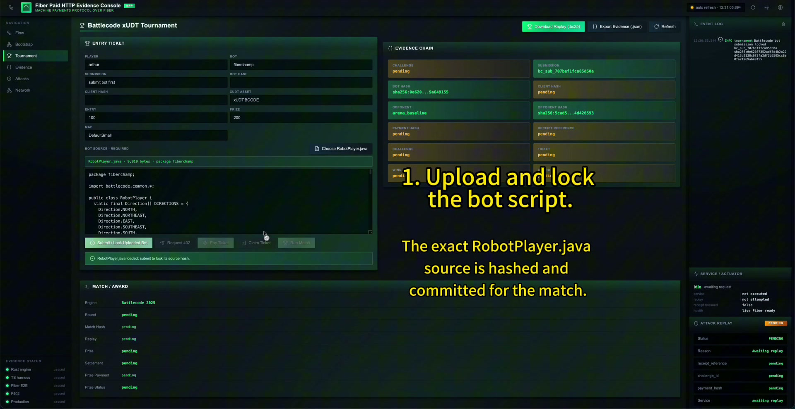
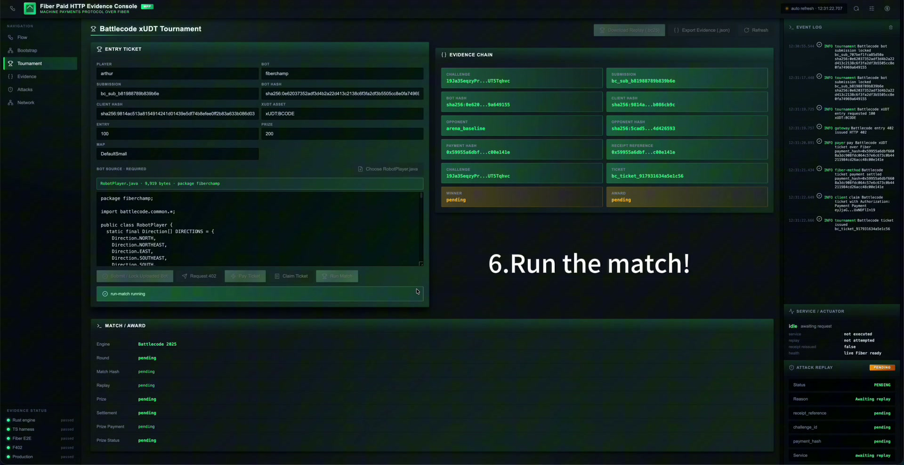
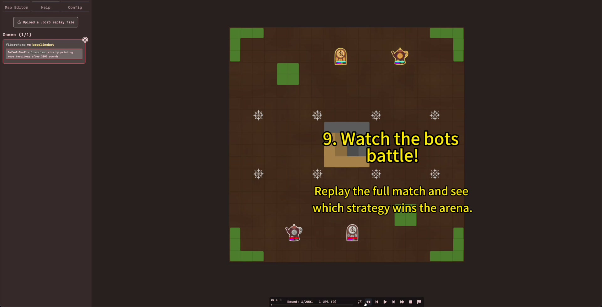
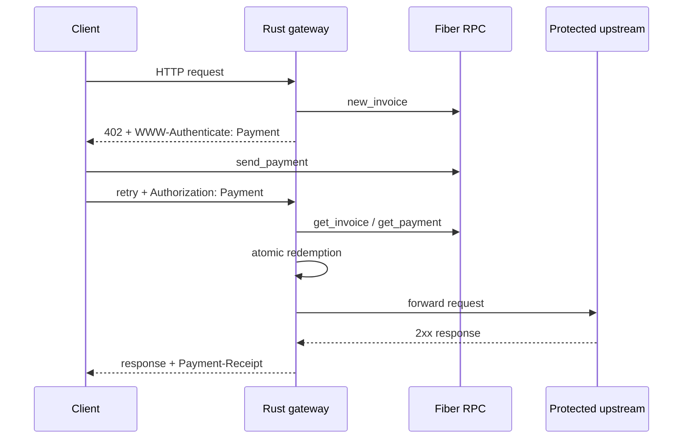

# Fiber Paid HTTP

**Turn Fiber settlement into replay-safe HTTP delivery.**

Fiber Paid HTTP is a Rust-first paid HTTP gateway for API developers and service operators. It implements the current MPP `Payment` draft core and proposes a `fiber` charge-method profile using Fiber invoices and settlement.

The project has one production verifier: Rust. TypeScript provides the SDK, Gateway Lab, vector generation, and explicit F402/F-L402 ingress adapters.

The project is the server-side enforcement layer between a paid HTTP request and a protected upstream. It does not operate a Fiber node, authorize a payer's wallet, facilitate x402 settlement, or define application policy. The browser application is a Gateway Lab for integration, operations, and audit evidence; machines use the HTTP protocol and SDKs directly.

## Hackathon demo

- **Hosted Gateway Lab:** [http://fiber.avato.online](http://fiber.avato.online)
- **Video demonstration:** [Fiber Paid HTTP — Gone in 60ms demo](https://github.com/a19q3/fiber-paid-http/releases/download/v0.1.0-hackathon/fiber-paid-http-demo.mp4)
- **Submission packet:** [docs/hackathon-submission.md](docs/hackathon-submission.md)
- **Category:** Merchant, Liquidity, LSP, and Multi-Asset Infrastructure — service metering and paid HTTP delivery

The hosted evaluator environment runs real FNN processes on an isolated local Fiber xUDT network with a funded demo payer. Preserved public-testnet and production-bootstrap evidence is committed under `reports/`. The hosted URL is an evaluator console, not a claim that the public endpoint itself is the recorded testnet run.

### Screenshots

| Bot source commitment | Fiber-paid entry and receipt | Battlecode replay |
| --- | --- | --- |
| [](docs/screenshots/battlecode-upload-lock.jpg) | [](docs/screenshots/fiber-paid-entry-receipt.jpg) | [](docs/screenshots/battlecode-match-replay.jpg) |

## What it does

1. A client requests a protected HTTP resource.
2. The gateway creates a Fiber invoice and returns `402 Payment Required` with `WWW-Authenticate: Payment ...`.
3. The client pays the invoice and retries with `Authorization: Payment ...`.
4. The gateway validates the exact echoed challenge, resource and body binding, Fiber settlement, and atomic single-use redemption.
5. A successful upstream `2xx` response receives `Payment-Receipt`; failed delivery never receives a receipt.



## Wire contract

The challenge is carried in `WWW-Authenticate: Payment` and has the current draft shape:

```json
{
  "id": "base64url-hmac-binding",
  "realm": "api.example.com",
  "method": "fiber",
  "intent": "charge",
  "request": "base64url-jcs-fiber-charge",
  "expires": "2026-07-13T12:00:00.000Z",
  "digest": "sha-256=:...:"
}
```

The Fiber method request encodes the invoice and settlement identity:

```json
{
  "amount": "100000000",
  "currency": "ckb",
  "methodDetails": {
    "invoice": "...",
    "paymentHash": "0x...",
    "network": "testnet",
    "hashAlgorithm": "ckb_hash"
  }
}
```

The retry credential exactly echoes the issued challenge:

```json
{
  "challenge": { "id": "...", "realm": "...", "method": "fiber", "intent": "charge", "request": "..." },
  "payload": { "paymentHash": "0x..." }
}
```

A receipt is schema evidence for successful delivery. It is not a second payment credential:

```json
{
  "status": "success",
  "method": "fiber",
  "timestamp": "2026-07-13T12:00:01.000Z",
  "reference": "0x...",
  "challengeId": "..."
}
```

## Compatibility entrances

- F402 input is mapped explicitly into the MPP-draft challenge or credential shape.
- F-L402 is an experimental adapter, disabled by default; when explicitly enabled, it uses a project-scoped HMAC capability plus a Fiber preimage and maps into the same MPP-draft credential verifier.
- Neither adapter changes settlement, resource binding, replay, delivery, or receipt rules.
- No adapter is silently selected; each ingress has one explicit parser and terminates at the same verifier.
- x402 v2 is an independent format adapter backed by the official codec. Fiber Paid HTTP is not an x402 facilitator and does not create a second settlement path.

The envelope codecs are exercised bidirectionally against the pinned current SDKs `mppx 0.8.6` and Rust `mpp 0.10.4`.

## Repository

| Path | Purpose |
| --- | --- |
| `crates/fiber-paid-http-core` | Rust MPP models, JCS, header codec, bindings, receipt and vectors |
| `crates/fiber-paid-http-server` | Axum gateway, Fiber verification, upstream delivery |
| `crates/fiber-paid-http-storage` | SQLite challenge, redemption, receipt, and delivery records |
| `crates/fiber-paid-http-fiber` | Fiber RPC builders and settlement polling |
| `crates/fiber-paid-http-cli` | Rust verifier and gateway CLI |
| `packages/core` | TypeScript SDK models and codecs |
| `packages/server-middleware` | TypeScript reference middleware |
| `packages/client` | Paid fetch client |
| `packages/f402-compat` | F402 ingress mapping |
| `packages/x402-compat` | x402 v2 exact/Fiber conversion boundary |
| `packages/fl402-compat` | F-L402 capability ingress |
| `apps/evidence-api` | Live flow and report API |
| `apps/evidence-web` | Gateway Lab for integration, operations, and audit evidence |
| `test-vectors` | 22 shared TS/Rust conformance fixtures |

## Quick start

Requirements: Node 24, pnpm 10.12.1, and Rust.

```bash
pnpm install --frozen-lockfile
pnpm build
export FIBER_PAID_HTTP_SECRET="$(openssl rand -hex 32)"
pnpm exec fiber-paid-http init --role gateway --out fiber-paid-http.gateway.json
pnpm exec fiber-paid-http doctor --role gateway --config fiber-paid-http.gateway.json
```

A production-facing gateway config must include:

- a non-empty `realm`;
- an HTTPS `public_base_url` used for resource binding;
- a positive smallest-unit `charge.amount` and `charge.currency`;
- a SQLite storage URI;
- real local or testnet Fiber RPC endpoints;
- secrets of at least 32 characters supplied through environment variables.

Plain HTTP is permitted only through an explicit local-development flag. Reverse proxies must terminate TLS and preserve the configured public route; inbound `Host` and forwarding headers are not trusted for payment binding.

## Verification

```bash
pnpm lint
pnpm typecheck
pnpm test
pnpm test:integration
pnpm test:fiber
pnpm build

cargo fmt --all --check
cargo clippy --workspace --all-targets -- -D warnings
cargo test --workspace

bash scripts/fiber_paid_http_rust_gate.sh
bash scripts/fiber_paid_http_canonical_gate.sh
pnpm gate
```

`pnpm test:fiber` always loads the preflight. A live run additionally requires `RUN_FIBER_E2E=1`, `FIBER_MODE=local|testnet`, payer and payee RPC endpoints, and a 32-character secret.

The canonical gate compares TypeScript and Rust on every deterministic vector for canonical hash, result, and error code. TypeScript is explicitly outside the trusted production verification boundary.

## Production safety

- SQLite redemption is atomic and unique by challenge, credential hash, and payment hash.
- Challenges and receipts are immutable after insertion.
- Credentials and preimages are never stored.
- Authentication material, invoices, capabilities, preimages, RPC auth, and secrets are redacted from operational logs.
- Error responses do not expose internal RPC or upstream details.
- `Payment-Receipt` is stripped from failed or forged upstream responses and emitted only after a protected `2xx` delivery.
- Production readiness evidence is valid only for the recorded Fiber commit and current protocol receipt schema.

See [positioning and ecosystem boundaries](docs/positioning.md), [protocol](docs/protocol.md), [Fiber method profile](docs/fiber-method.md), [architecture](docs/architecture.md), [security](docs/security.md), [production readiness](docs/production-readiness.md), and [hackathon submission](docs/hackathon-submission.md).
