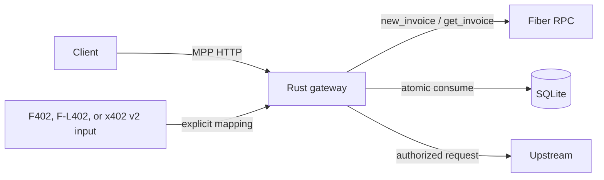

# Architecture

## Trust boundary

Rust is the production verification boundary. TypeScript is SDK, Evidence Console, adapters, and conformance tooling. The canonical gate asserts `typescript_trusted_boundary: false`.

The browser UI is the **Fiber Paid HTTP Gateway Lab**. Backend integrators, service operators, judges, and auditors use it to exercise and inspect the gateway. It is not a wallet, participant application, Fiber node control plane, or machine-facing runtime. Automated clients integrate through HTTP and the SDKs.

The diagram has one enforcement path. Adapters normalize input before the Rust verifier; none owns settlement, redemption, upstream delivery, or receipt issuance.

## Components

| Component | Responsibility |
| --- | --- |
| `fiber-paid-http-core` | MPP schemas, JCS, header codec, challenge binding, receipt validation, vectors |
| `fiber-paid-http-fiber` | Fiber JSON-RPC parameters, invoice creation, payment and invoice polling |
| `fiber-paid-http-storage` | Canonical schema v1 SQLite store and atomic redemption |
| `fiber-paid-http-server` | Axum challenge, verification, delivery, and receipt path |
| `fiber-paid-http-cli` | Gateway start, doctor, challenge/receipt inspection, vector verification |
| `fiber-paid-http-x402` | Strict x402 v2 exact/Fiber boundary conversion |
| TypeScript packages | Client SDK, reference middleware, UI, adapters, vector generation |

## Request lifecycle

The gateway derives the resource from configured `public_base_url` plus request path/query. It never binds payment to inbound `Host` or forwarding headers.

Challenge issuance stores the exact challenge, decoded charge, resource descriptor, creation time, and expiry. Verification performs no network call while holding the store lock. After Fiber reports settlement, the gateway atomically consumes the challenge and inserts the redemption. The request is then forwarded upstream.

The upstream response cannot inject `Payment-Receipt`; the gateway strips it. A new MPP-draft receipt is written and returned only for `2xx` delivery.

## Storage invariants

- challenge IDs are immutable;
- one redemption per challenge;
- credential hash and payment hash are unique;
- receipts are immutable by reference;
- credentials, capabilities, and preimages are not persisted;
- delivery failures are retained for reconciliation;
- TypeScript and Rust use the same schema-v1 tables and columns;
- any unsupported version, extra application table, or noncanonical column layout fails closed.

## Compatibility

F402, F-L402, and x402 v2 are boundary adapters only. They terminate before the canonical credential verifier, so they cannot bypass Fiber settlement, resource binding, atomic redemption, or receipt-on-success rules. The x402 package also maps a successful MPP receipt to a `SettleResponse`; it never settles funds itself.

MPP remains the primary draft wire contract and `fiber` remains a proposed method profile. x402 is an independent compatibility boundary, not another name for MPP. F-L402 is experimental and disabled unless an operator explicitly configures it.
