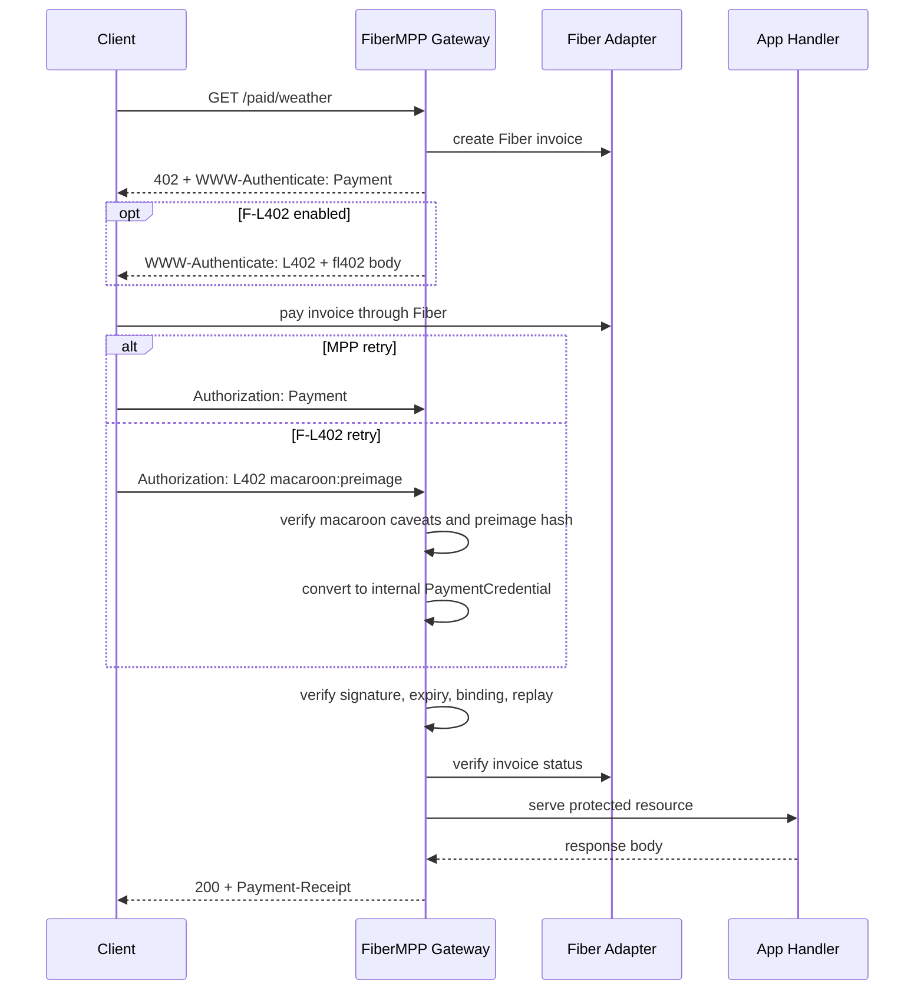

# Architecture

FiberMPP is a dual TypeScript and Rust workspace for Fiber Paid HTTP.

## TypeScript Layers

- `packages/core`: typed protocol model, canonical JSON, HMAC signatures, base64url encoding, resource hashes, HTTP header helpers.
- `packages/storage`: replay/session/receipt storage interface plus durable SQLite implementation.
- `packages/fiber-method`: Fiber JSON-RPC adapter for local/testnet Fiber nodes.
- `packages/f402-compat`: F402 challenge/proof conversion.
- `packages/fl402-compat`: F-L402 macaroon/preimage adapter and `Authorization: L402` helpers.
- `packages/server-middleware`: route protection, reverse proxy mode, MPP challenge issuance, optional F-L402 challenge issuance, and F-L402 proof conversion.
- `packages/client`: paid fetch helper.
- `packages/cli`: gateway, bootstrap, payment, F402/F-L402, vector, and local evidence tooling.
- `apps/evidence-api`: local evidence API for the 402 -> Fiber payment -> receipt -> replay rejection flow.
- `apps/evidence-web`: browser evidence console.

## Rust Layers

- `crates/fiber-mpp-core`: canonical hashes, signatures, vector verification.
- `crates/fiber-mpp-storage`: replay storage trait and SQLite durable store.
- `crates/fiber-mpp-fiber`: Fiber JSON-RPC method names, hex quantities, and settlement status semantics.
- `crates/fiber-mpp-f402`: F402 proof/credential compatibility helpers.
- `crates/fiber-mpp-fl402`: F-L402 macaroon/preimage verification helpers.
- `crates/fiber-mpp-server`: Axum/Tower paid HTTP gateway with optional `Authorization: L402` support.
- `crates/fiber-mpp-cli`: `fiber-mpp-rs` binary.

## Adapter Matrix

| Adapter | Challenge source | Client retry | Internal verifier |
| --- | --- | --- | --- |
| MPP + Fiber | Signed `PaymentChallenge` with Fiber method | `Authorization: Payment <credential>` | Stored challenge, resource binding, replay store, Fiber invoice settlement, signed receipt. |
| F402 | F402-like invoice/payment-hash JSON | F402 proof converted by CLI/adapter | Converted to internal `PaymentCredential`. |
| F-L402 | Same Fiber invoice plus `fl402-macaroon-v1` caveats | `Authorization: L402 <macaroon>:<preimage>` | Preimage hash + caveat verification, then converted to internal `PaymentCredential`. |
| x402 | Future Fiber native x402 support | Future x402 headers | Should reuse settlement, replay, and receipt boundaries. |

## Request Flow

## Storage

The middleware and Rust gateway store issued challenges, used credentials, receipts, payment observations, resource hashes, and idempotency state. Durable SQLite or Redis-compatible storage is required for real deployments.
