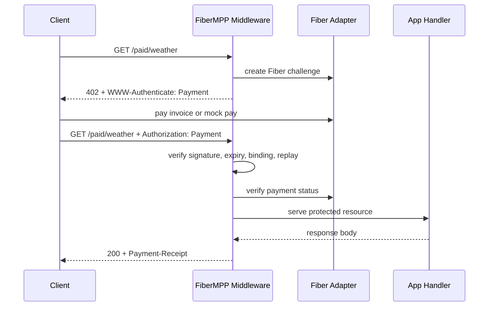

# Architecture

FiberMPP is a TypeScript monorepo with these layers:

- `packages/core`: typed protocol model, canonical JSON, HMAC signatures, base64url encoding, resource hashes, HTTP header helpers.
- `packages/storage`: replay/session/receipt storage interface plus in-memory and SQLite implementations.
- `packages/fiber-method`: Fiber JSON-RPC adapter and explicit mock adapter.
- `packages/f402-compat`: F402 challenge/proof conversion.
- `packages/server-middleware`: route protection and reverse proxy mode.
- `packages/client`: paid fetch helper.
- `packages/cli`: test and demo command line tool.
- `apps/demo-api`: local paid API demo.
- `apps/demo-web`: small browser demo UI.

## Request flow

## Storage

The middleware stores issued challenges, used credentials, receipts, payment observations, resource hashes, and idempotency state. In-memory storage is for tests and local demos only. Production mode rejects it unless `ALLOW_IN_MEMORY_STORE=1`.
